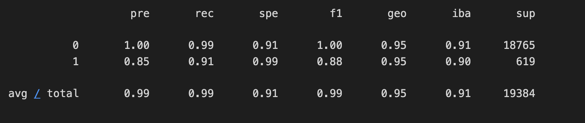
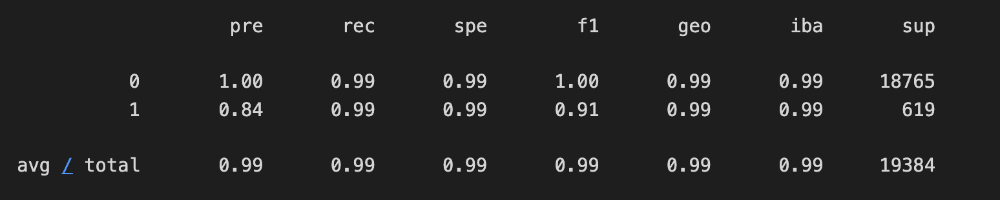

# credit_risk_resampling

## Overview of the Analysis

The purpose of the analysis is to build a model that can identify the creditworthiness of borrowers. The analysis uses a Linear Regression model to predict high-risk loans vs healthy loan. However, since historically industry lending data  is skwed towards healthy loans two models were used one with the original data set and the other that oversamples high-risk loans in orders to adjust for the under respenstation of high risk loan data. The models were created with SkLearn LogisticRegression model. The models output the following overall average predictions accuracy of healthy vs high risk loans. 

## Results

* Machine Learning Model 1: Original Data 
  * Description of Model 1 Accuracy, Precision, and Recall scores.

    * For healthy loan the precision is 100% and for high risk loans is only 85%. The recall healthy loan the is 99% and for high risk loans is only 91%. This indicates that model is fairly good for healthy loans but for high risk loans the risk is higher that high risk loans are miss classified as healthy loans. The F1 score for healthy loans is good at 99% vs high risk loan at 88% which indicates that the model failed to identify positive cases while avoiding false positives and false negatives 12% of the time. 

* Machine Learning Model 2: Over sample data using RandomOverSampler

  * The overall performance of this model is similar to the original however the accuracy for high risk loan has greatly improved in terms of recall and F1 score which indicates that it is better at predicting high risk loans. 

## Summary

Overall, the performance of both models for healthy loans were fairly the same. The improvements of model 2 - oversampling is better with high risk loans which can be seen with the improvement of the recall and F1 score which means there are less false positve of high risk loans being classified as healthy loans which I originally predicted would be the case as a result of the under represented data set of high risk loans. 

